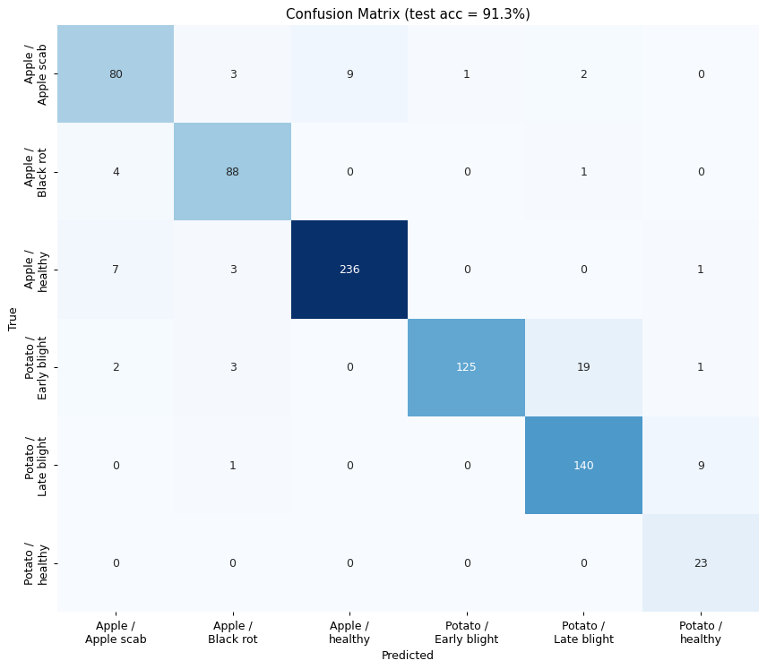
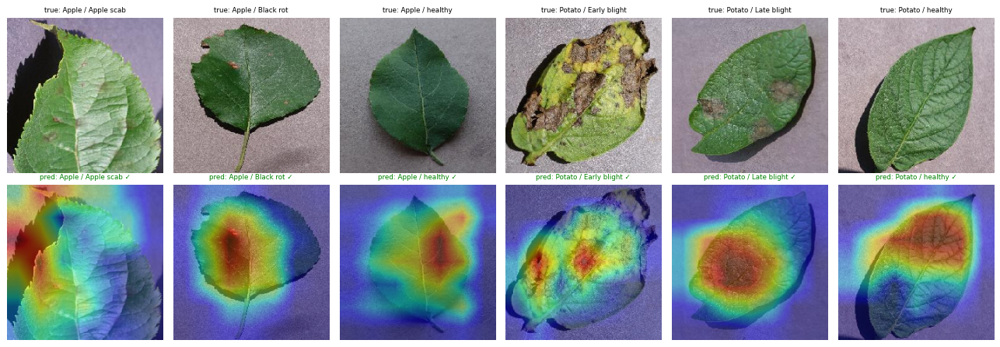
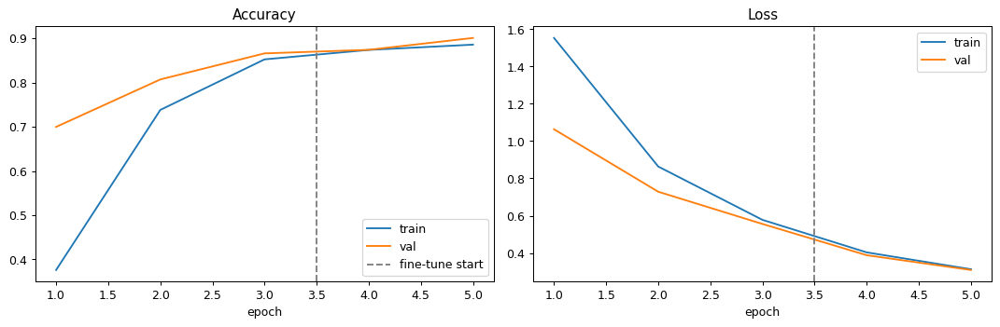

# 🌱 Plant Disease Detection — CNN + Transfer Learning


Classify crop-leaf images as **healthy** or **diseased** with a convolutional
neural network built on **transfer learning** (MobileNetV2) over the
[PlantVillage](https://github.com/spMohanty/PlantVillage-Dataset) dataset.

The project covers the full workflow: data verification → a reproducible input
pipeline → two-phase transfer learning → evaluation with a confusion matrix →
**Grad-CAM** explanations → single-image inference.

---

## 🔎 Results (6-class demo build)

Trained on an Apple + Potato subset to keep the demo light. On the held-out test
set the model reaches **~91% accuracy** with a macro-F1 of **0.89**.

| Confusion matrix | Grad-CAM (where the model looks) |
|---|---|
|  |  |

The Grad-CAM overlays confirm the network focuses on the **lesions** on the leaf
rather than the background — evidence it learned meaningful features.

Training was stable across both phases (validation tracks training closely, no
overfitting):



> Numbers are from the bundled sample. Training on the full 38-class dataset with
> a GPU produces different (and more complete) figures — just re-run the notebook.

---

## ✨ Highlights

- **Transfer learning** with MobileNetV2; backbone preprocessing baked into the
  model so training and inference stay consistent.
- **Two-phase training** — train the classifier head, then fine-tune the top
  backbone layers at a low learning rate (BatchNorm kept frozen).
- **Stratified** train/val/test split with saved manifests for reproducible
  evaluation.
- **Class-imbalance handling** via inverse-frequency class weights.
- **Data augmentation** applied to the training set only.
- **Explainability** with Grad-CAM.
- Available as both a **narrative notebook** and a **modular `src/` package**.

---

## 📁 Project structure

```
plant-disease-detection/
├── plant_disease_detection.ipynb   # full walkthrough notebook (start here)
├── src/                            # modular, importable version of the pipeline
│   ├── data_loader.py              #   split, augmentation, tf.data, class weights
│   ├── model.py                    #   transfer-learning model + fine-tuning helper
│   ├── train.py                    #   two-phase training CLI
│   └── evaluate.py                 #   metrics, confusion matrix, Grad-CAM
├── data/
│   ├── sample/                     # small runnable sample (committed)
│   └── README.md                   # how to download the full dataset
├── assets/                         # charts used in this README
├── models/                         # class_names.json (trained model is generated)
├── scripts/download_data.sh        # fetch the full dataset
├── requirements.txt
└── README.md
```

---

## 🚀 Quickstart

```bash
# 1. Install dependencies
python -m venv .venv && source .venv/bin/activate   # Windows: .venv\Scripts\activate
pip install -r requirements.txt

# 2. Run the notebook (uses the bundled sample out of the box)
jupyter notebook plant_disease_detection.ipynb
```

Prefer scripts over the notebook?

```bash
python -m src.train                 # two-phase training
python -m src.evaluate              # metrics + confusion matrix + Grad-CAM
```

### Train on the full dataset
```bash
bash scripts/download_data.sh github-full   # ~2 GB, 38 classes
# then set DATA_DIR = Path('data/raw') in the notebook (or point src/ at it)
```

---

## 🧠 How it works

1. **Data pipeline** — images are gathered per class, split with stratification,
   and streamed through `tf.data` (decode → resize → augment → batch → prefetch).
   Outputs stay in `[0, 255]`; normalization happens inside the model.
2. **Model** — a frozen MobileNetV2 backbone + a global-average-pooling head with
   dropout and a softmax classifier.
3. **Training** — Phase 1 trains the head; Phase 2 unfreezes the top ~30% of the
   backbone and fine-tunes at `1e-5`. EarlyStopping and ReduceLROnPlateau guard
   against overfitting.
4. **Evaluation** — per-class precision/recall/F1, a confusion matrix, and
   Grad-CAM overlays on held-out images.

---

## 🗺️ Roadmap

- [ ] Train and report full 38-class results
- [ ] Streamlit web app for live image upload + diagnosis
- [ ] Compare backbones (EfficientNetB0, ResNet50)

---

## 📊 Dataset

**PlantVillage** — 54,305 labeled leaf images, 38 crop/disease classes, 256×256
RGB. Sources: [Kaggle](https://www.kaggle.com/datasets/abdallahalidev/plantvillage-dataset)
· [GitHub mirror](https://github.com/spMohanty/PlantVillage-Dataset). See
[`data/README.md`](data/README.md) for download options.

## 📄 License

Code released under the MIT License. The PlantVillage dataset retains its
original license from the linked sources.
